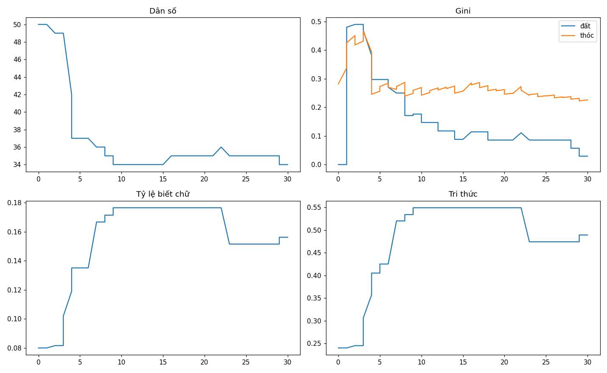
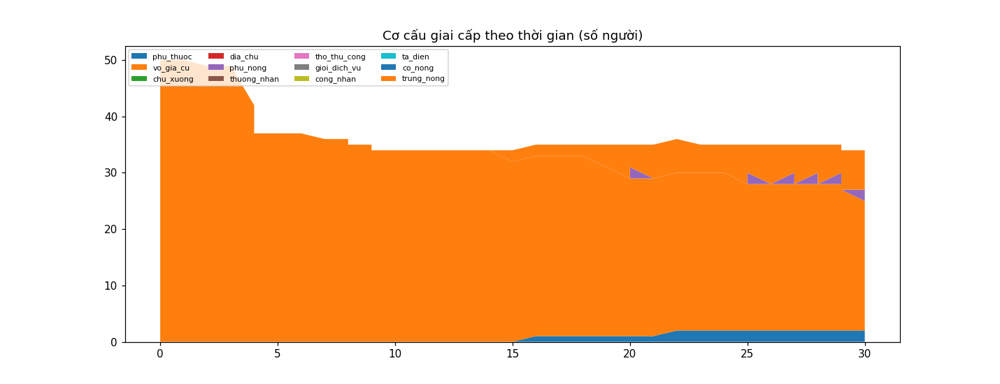

# Phân tích cuối run `review_real_30y_v1`

- Tick cuối: 60 (năm 30); dân số 34; gini đất 0.0294; biết chữ 16%; tri thức 0.489
- β thừa kế của cải (log-log, n=0): **nan**
- Công nghiệp hóa: chưa đạt trong run này

## Ma trận dịch chuyển giai cấp cha→con (n=0)

| cha \ con | phu_thuoc | vo_gia_cu | chu_xuong | dia_chu | phu_nong | thuong_nhan | tho_thu_cong | gioi_dich_vu | cong_nhan | ta_dien | co_nong | trung_nong |
|---|---|---|---|---|---|---|---|---|---|---|---|---|

## Milestones

- Năm 5: blueprint_dau
- Năm 25: hop_dong_van_ban_dau
- Năm 25: hop_dong_van_ban_dau

## Sử ký (chronicle)

> Năm 10: làng có 34 nhân khẩu. Chuyện đáng nhớ: blueprint dau. Ruộng đất kẻ nhiều người ít (gini 0.1765). 18% người lớn biết chữ.

> Năm 20: làng có 35 nhân khẩu. Ruộng đất kẻ nhiều người ít (gini 0.0857). 18% người lớn biết chữ.

> Năm 30: làng có 34 nhân khẩu. Chuyện đáng nhớ: hop dong van ban dau. Ruộng đất kẻ nhiều người ít (gini 0.0294). 16% người lớn biết chữ.

## Biểu đồ

