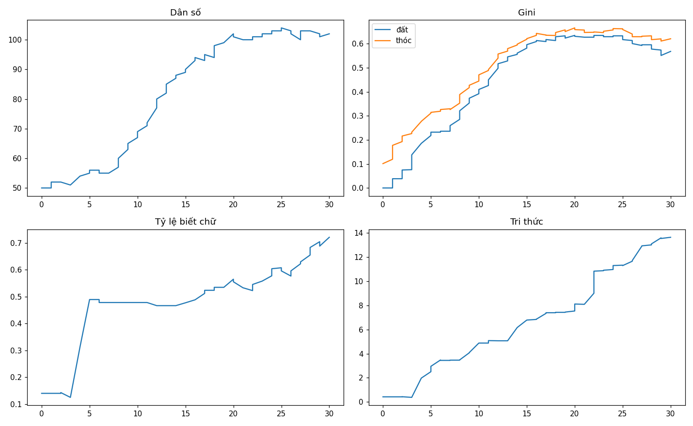
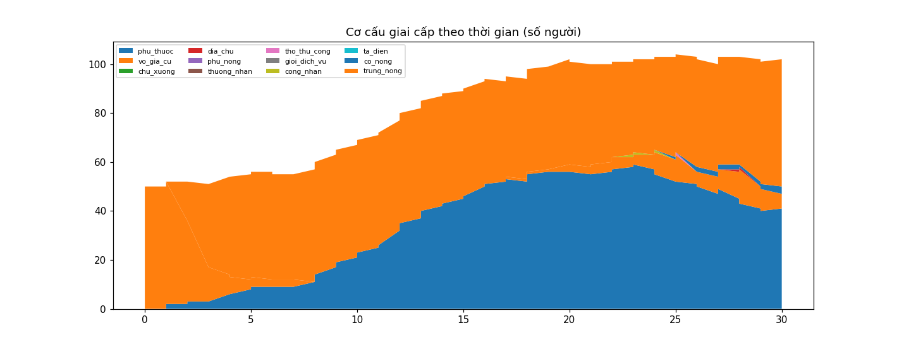

# Phân tích cuối run `vidtest`

- Tick cuối: 60 (năm 30); dân số 102; gini đất 0.5678; biết chữ 72%; tri thức 13.643
- β thừa kế của cải (log-log, n=0): **nan**
- Công nghiệp hóa: chưa đạt trong run này

## Ma trận dịch chuyển giai cấp cha→con (n=0)

| cha \ con | phu_thuoc | vo_gia_cu | chu_xuong | dia_chu | phu_nong | thuong_nhan | tho_thu_cong | gioi_dich_vu | cong_nhan | ta_dien | co_nong | trung_nong |
|---|---|---|---|---|---|---|---|---|---|---|---|---|

## Milestones

- Năm 1: mo_tip_gui_rut_dau
- Năm 4: blueprint_dau
- Năm 7: hang_moi_dau
- Năm 14: san_tri_thuc_tang
- Năm 15: may_dau
- Năm 19: entity_dau
- Năm 22: nhan_xuong_dau
- Năm 25: vi_pham_cuong_che_dau
- Năm 25: vi_pham_cuong_che_dau
- Năm 25: vi_pham_cuong_che_dau
- Năm 25: vi_pham_cuong_che_dau

## Sử ký (chronicle)

> Năm 10: làng có 67 nhân khẩu. Chuyện đáng nhớ: mo tip gui rut dau, blueprint dau, hang moi dau. Ruộng đất kẻ nhiều người ít (gini 0.3919). 48% người lớn biết chữ.

> Năm 20: làng có 102 nhân khẩu. Chuyện đáng nhớ: san tri thuc tang, may dau, entity dau. Ruộng đất kẻ nhiều người ít (gini 0.6343). 57% người lớn biết chữ.

> Năm 30: làng có 102 nhân khẩu. Chuyện đáng nhớ: nhan xuong dau, vi pham cuong che dau, vi pham cuong che dau, vi pham cuong che dau. Ruộng đất kẻ nhiều người ít (gini 0.5678). 72% người lớn biết chữ.

## Biểu đồ

