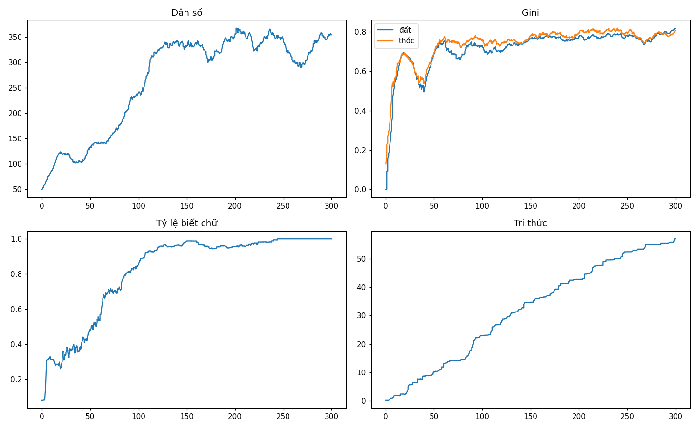
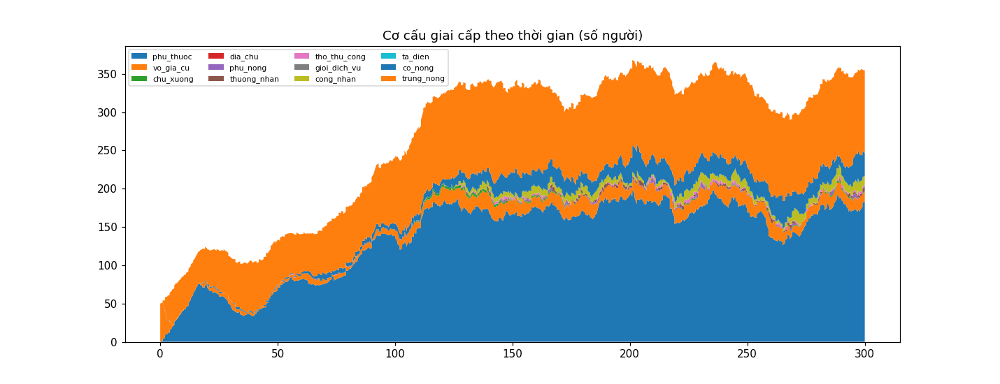

# Phân tích cuối run `mock300`

- Tick cuối: 600 (năm 300); dân số 355; gini đất 0.8166; biết chữ 100%; tri thức 56.964
- β thừa kế của cải (log-log, n=580): **0.121**
- Công nghiệp hóa: NĂM 160

## Ma trận dịch chuyển giai cấp cha→con (n=599)

| cha \ con | phu_thuoc | vo_gia_cu | chu_xuong | dia_chu | phu_nong | thuong_nhan | tho_thu_cong | gioi_dich_vu | cong_nhan | ta_dien | co_nong | trung_nong |
|---|---|---|---|---|---|---|---|---|---|---|---|---|
| **vo_gia_cu** | 0 | 0 | 0 | 0 | 0 | 0 | 0 | 0 | 0 | 0 | 0 | 4 |
| **chu_xuong** | 0 | 0 | 0 | 0 | 0 | 0 | 0 | 0 | 0 | 0 | 0 | 5 |
| **phu_nong** | 0 | 0 | 0 | 0 | 0 | 0 | 0 | 0 | 0 | 0 | 1 | 0 |
| **thuong_nhan** | 0 | 0 | 0 | 0 | 0 | 0 | 0 | 0 | 0 | 0 | 1 | 3 |
| **tho_thu_cong** | 0 | 0 | 0 | 0 | 0 | 0 | 0 | 0 | 0 | 0 | 0 | 2 |
| **cong_nhan** | 0 | 0 | 0 | 0 | 0 | 0 | 0 | 0 | 0 | 0 | 3 | 5 |
| **co_nong** | 0 | 0 | 0 | 0 | 0 | 2 | 0 | 0 | 1 | 0 | 2 | 30 |
| **trung_nong** | 0 | 1 | 2 | 0 | 2 | 2 | 6 | 0 | 27 | 0 | 44 | 456 |

## Milestones

- Năm 1: mo_tip_gui_rut_dau
- Năm 6: vi_pham_cuong_che_dau
- Năm 8: blueprint_dau
- Năm 22: hop_dong_van_ban_dau
- Năm 23: hang_moi_dau
- Năm 28: san_tri_thuc_tang
- Năm 51: bao_hiem_dau
- Năm 53: may_dau
- Năm 54: entity_dau
- Năm 60: co_phan_doi_chu_dau
- Năm 108: nhan_xuong_dau
- Năm 160: cong_nghiep_hoa

## Sử ký (chronicle)

> Năm 210: làng có 359 nhân khẩu. Ruộng đất kẻ nhiều người ít (gini 0.7764). 96% người lớn biết chữ.

> Năm 220: làng có 325 nhân khẩu. Ruộng đất kẻ nhiều người ít (gini 0.7725). 98% người lớn biết chữ.

> Năm 230: làng có 350 nhân khẩu. Ruộng đất kẻ nhiều người ít (gini 0.7919). 98% người lớn biết chữ.

> Năm 240: làng có 358 nhân khẩu. Ruộng đất kẻ nhiều người ít (gini 0.7904). 99% người lớn biết chữ.

> Năm 250: làng có 343 nhân khẩu. Ruộng đất kẻ nhiều người ít (gini 0.7796). 100% người lớn biết chữ.

> Năm 260: làng có 303 nhân khẩu. Ruộng đất kẻ nhiều người ít (gini 0.7698). 100% người lớn biết chữ.

> Năm 270: làng có 298 nhân khẩu. Ruộng đất kẻ nhiều người ít (gini 0.754). 100% người lớn biết chữ.

> Năm 280: làng có 323 nhân khẩu. Ruộng đất kẻ nhiều người ít (gini 0.7807). 100% người lớn biết chữ.

> Năm 290: làng có 358 nhân khẩu. Ruộng đất kẻ nhiều người ít (gini 0.8026). 100% người lớn biết chữ.

> Năm 300: làng có 355 nhân khẩu. Ruộng đất kẻ nhiều người ít (gini 0.8166). 100% người lớn biết chữ.

## Biểu đồ

